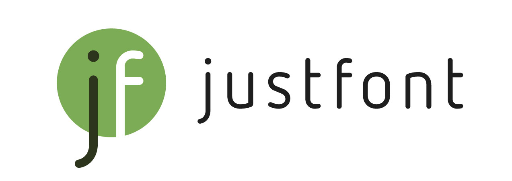

# 諧靈附體 AllPunType

     

使用 **諧靈附體** ，你必須諧音，只能諧音。

## 計畫緣起

今年，我們觀察到台灣似乎正迎接諧音哏的文藝復興，尤其是年度生肖吉祥話特別猖狂。龍光煥發、龍喜利啦、龍 time no see….。

俗話說，打不過就加入他。雖然諧音有夠煩，但每當偶遇佳作，仍令人欣喜。因此，今年愚人節 justfont 再度不開玩笑，為您隆重推出新開源字型「**諧靈附體**」，替未來每一年的生肖諧音大戰增添柴火。要諧大家一起諧啊啊啊啊啊啊

## 使用效果是？

我們將所有生肖的相近音漢字，全部替換成生肖本字。如：「使、書、死、叔、蘇⋯⋯」打字出來會是「`鼠`」；「榮、隆、攏、農、弄⋯⋯」會變成「`龍`」。順帶一提，常見英語諧音及日文五十音如「surprise! 」、「すごい！」，也會被顯示成「`蛇prise!`」、「`鼠狗い！`」，滿足國人對諧音喪心病狂的熱愛。

## 規格簡介

**「諧靈附體」** 是基於源流明體字型改作，由 [justfont](https://justfont.com/) 的團隊製作，包含 7 種字重的字型家族。

透過於字符碼位替換字形並輔以 OpenType 技術，製作出輸入「近音字」時，就會顯示出「生肖動物字」的開源繁體中文字型。十二生肖收錄齊全，萬年可用。年節將至或生活不順（？）時，皆可使用本字型進行靈感發想，或煩死朋友。

本字型以 SIL Open Font License 1.1 授權釋出，歡迎大家自由應用，並分享給你所有的朋友。

## 下載與使用

### 下載

- 請 [點我](https://github.com/justfont/AllPunType/releases/tag/1.0) 前往下載頁面。
- 或是點選本頁面右側「Releases」處的最新發行版本，按照自己的需求下載以 **AllPunType** 開頭的 otf 字型檔案安裝（是的，英文名稱又是爛諧音）。

### 使用

- Pages, Keynote, Adobe Illustrator, Adobe Photoshop, Microsoft Word, [下筆](https://apps.apple.com/tw/app/下筆-質感繁中文編輯/id1627492456), Procreate, InShot 等多數圖像影音編輯與文書軟體：皆可正確顯示所有替換功能（部分軟體需手動開啟連字樣式功能）。
- Microsoft Excel, Microsoft PowerPoint：英文替換無法使用。

## 支援顯示文字

收錄讀音表請見[傳送門](https://docs.google.com/spreadsheets/d/1_DLkmWgDF4cJQAhlMe-ppDrK4M-BeX_3S09y9bl_09U/edit?usp=sharing)，並由 justfont 團隊工人智慧增加日語、英語，並排除不常用的破音漢字。

理論上**諧靈附體**可無限期應用，但因 justfont 人力與時間有限，目前暫無規劃確切更新時程，還請見諒。也歡迎有志之士自行改作新款開源字型釋出。

## 應用範例

- 幫助發想諧音哏：
    - 過年過節，被長官長輩逼著想吉祥話？這時，**諧靈附體**是你的好夥伴。隨意將文章套用諧靈附體，保證會有新的發現😉
    - 

- 迎新尾牙最佳遊戲：
    - 團康活動沒梗了？將文章套用成**諧靈附體**，比賽誰能最快朗誦出原本的文字。保證好玩，還很荒謬。應該啦。
    -  
  
- 密碼產生器：
    - 發限動抱怨時想加密？使用[下筆](https://apps.apple.com/tw/app/下筆-質感繁中文編輯/id1627492456)搭配**諧靈附體**來發文，這樣不管翻譯年糕、或 AI 圖轉文工具，都無法看懂你的內容囉😎（因為都是密碼了所以沒有範例圖）
  
- 只是想拿來煩朋友：
    - 如題，就很煩啊。
    - 
    

## 更新紀錄

- `1.0` (2024/4/1)
    - 初次對外公開。

## 免費使用、敬請分享

**諧靈附體** 改作於 [@ButTaiwan](https://github.com/ButTaiwan) 發佈的 [源流明體](https://github.com/ButTaiwan/genryu-font) 開源專案，並基於 SIL Open Font License 1.1 開源協議授權釋出。

您可以放心地：

- **自由應用**：無需付費、知會或標明原作者，即可自由使用或研究本字型，亦可用為商業應用，惟不可將本字體作為產品販售。
- **自由散布**：可自由分享、複製本字體檔案，或是將字體檔案安裝於任何軟硬體中。
- **自由改作**：可自由將字型檔案修改重製為其他字型檔案，惟改作後的字型檔案仍須同樣依 SIL Open Font License 釋出。

完整的授權規定詳見：

- SIL Open Font License 1.1 - SPDX：[https://spdx.org/licenses/OFL-1.1.html](https://spdx.org/licenses/OFL-1.1.html)
- 中譯參考版本：[http://florenceko.me/?p=2089](http://florenceko.me/?p=2089)

## 特別感謝

- 柯志杰 [@ButTaiwan](https://github.com/ButTaiwan) 先生發佈之改作開源字型「**源流明體**」 ：[GitHub Page](https://github.com/ButTaiwan/genryu-font)
- Adobe 與 Google 提供之開源字型「**思源宋體**（Noto Serif）」：[GitHub Page](https://github.com/adobe-fonts/source-han-serif/blob/master/README-TW.md)
- 所有愛字的好夥伴們，與看到這裡的你

---

# 關於 justfont

justfont 官方網站 👉  [https://justfont.com](https://bit.ly/40Lj9bJ)

字體不但佔據閱讀的目光，也引導了生活中的每個決定。字體更構築了城市街道的風景，是關乎美感，最重要的視覺纖維。在人人都能用字型的時代，更能透過方便的科技，將專家職人的心血結晶應用在生活中。

可惜，臺灣長期以來，不論學院或產業，字體都未能得到足夠關注，也缺乏深度耕耘。不僅導致設計從業者能力斷層，一般民眾也對每日都會用到的字體缺乏認識。長久以往，街道上充斥不易理解、不甚美觀的字體排印。版權觀念薄弱，盜版盛行，更導致字型廠商在消費端無立足之地，紛紛轉型或外移。如此負向循環，讓臺灣的「文字風景」難以起色。

justfont 相信字體的價值，更相信好的字體能啟發社會。除了細心栽培一筆一劃，我們更願做字體推廣教育的先行者、教育者與輔導者，致力於培育臺灣下一代的設計力量。從基礎建設與教育開始，提升臺灣的美學環境。邀請您一起來，創造更好的文字風景。

---

# 免責事項

本字型基於開源授權釋出，對本字型的下載、安裝、與安裝後相關之問題，及可能導致之一切可能損害，justfont 皆不承擔相關責任。

